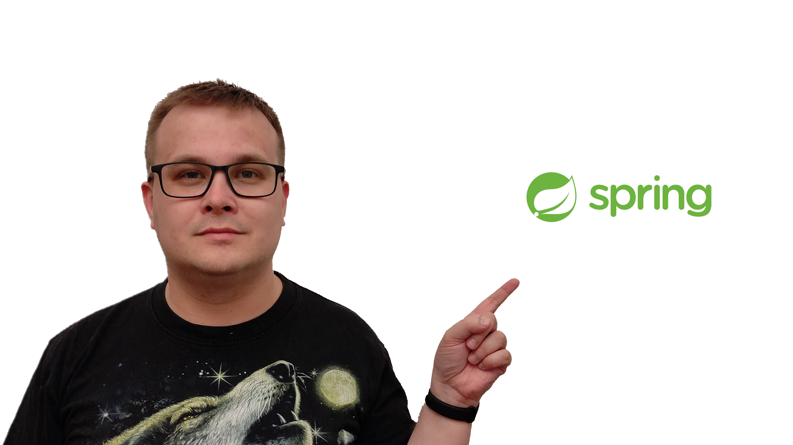

# About me

**Cenbit Founder** 🔹 **BFC** 🔹 **Experienced developer** 🔹 **Speaker and trainer** 🔹 **YouTuber and blogger** 🔹 **Spring Boot** 🔹 **Microservices** 🔹 **Vue.js** 🔹 **Nuxt.js** 🔹 **Webinars and IT trainings**

**Hello!** 👋

My name is **Paul Wilczek** and I am a **master engineer** of **computer science**.

I help solve problems related to **developing web pages**.

I specialize in **[Nuxt.js](https://pawel-wilczek.mojezapiski.pl/ "one of my projects in which I used Nuxt.js is the project of my online business card")** and **[Spring Boot](https://cenbit.pl/ "my project in which I used Spring Boot is the project of the online video course search engine, Cenbit, of which I am the founder")**, but I also do not rule out **developing microservices** in other programming languages adapted to a given area, such as **Machine Learning** in **Python**.

I train developers mainly with **[Nuxt.js](https://www.bielbit.pl/ "the project in which I used Nuxt.js is a project of a new company website")**/**[Vue.js](https://lexbit.bielbit.pl/ "project in which I used Vue.js")**, but I also consult projects written in **[Spring Boot](https://cenbit.pl/ "my project in which I used Spring Boot is the project of the online video course search engine, Cenbit, of which I am the founder")**.

Although I am a **developer** by vocation, I also deal with **systems** and **databases administration**.

Professionally, I mainly write applications in **[PHP](http://web.archive.org/web/20220204094132/https://czesci.fcapoland.pl/ "one of the first projects written in PHP on which I had the opportunity to work")**, **[JavaScript](https://www.bielbit.pl/ "one of the projects I wrote in JavaScript was the design of a new company website")/[TypeScript](https://lexbit.bielbit.pl/ "project where I was writing in TypeScript")** (including **[Vue.js](https://lexbit.bielbit.pl/ "project in which I used Vue.js")** and **[Nuxt.js](https://www.bielbit.pl/ "the project in which I used Nuxt.js is a project of a new company website")**) and **[C#](https://lexbit.bielbit.pl/ "one of the projects written in C# on which I had the opportunity to work")**, and also write **BASH** scripts.

My main passion is writing applications in **[Spring Boot](https://cenbit.pl/ "my project in which I used Spring Boot is the project of the online video course search engine, Cenbit, of which I am the founder")** and in **[Nuxt.js](https://pawel-wilczek.mojezapiski.pl/ "one of my projects in which I used Nuxt.js is the project of my online business card")**, i.e. **Vue.js** on steroids.

In my free time, I create **[my open blog](https://mojezapiski.pl/ "my open blog")** and learn from **video courses** and **books** useful in my work and my hobby, in which I am trying to launch a **[social network portal](https://socialtube.pl/ "my social network portal project")**.

I am developing in various areas related to **IT**.

Apart from **IT**, I am also interested in **crime series** and **cabarets**.

In high school, in 2008, [2009](https://www.youtube.com/watch?v=iW8FksnGJlo "my lecture at the conference BioMedTech Silesia Junior 2009") and 2010, I participated in the **BioMedTech Silesia Junior** conference, giving lectures.

## 🛠 Tech stack

## Find me around the web 🌍

- 🗣 [My website](https://pawel-wilczek.mojezapiski.pl/)
- 🔴 [YouTube](https://www.youtube.com/@pawewilczek5102)
- 📸 [Instagram](https://www.instagram.com/spring.java.nuxt.js.developer/)
- 🐦 [Twitter](https://twitter.com/CyberZiom)
- 🔗 [Linkedin](https://pl.linkedin.com/in/pawe%C5%82-wilczek-885803151)

## My GitHub Stats 📈

